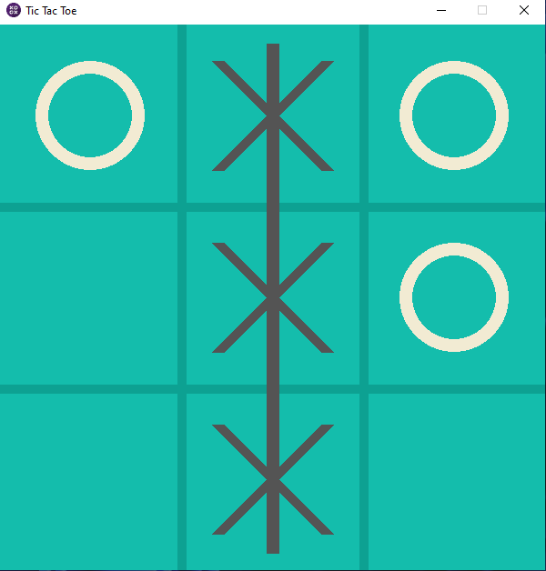
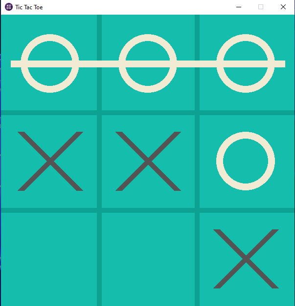
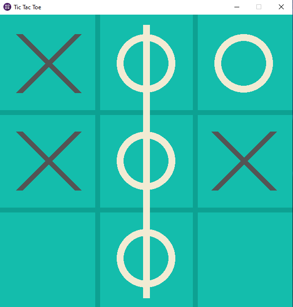
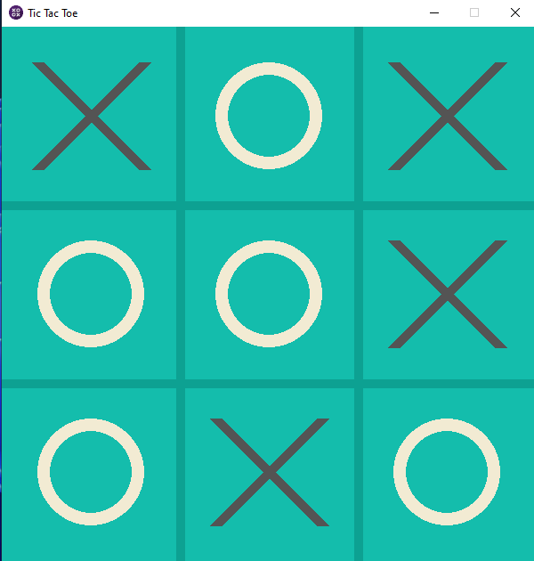

# 🎮 Tic-Tac-Toe-game-using-Python
I made a Tic Tac Toe game using the pygame module Python

## `How to play`

1. Open the "main.py" file using your IDE
2. Run the Code
3. Play

## `Controls`

1. Press "Left Mouse Click" or "Right Mouse Click" to Mark the Squares
2. Press "Spacebar" to Restart the Game after the Player wins or the Board is Full

## `Screenshots`

